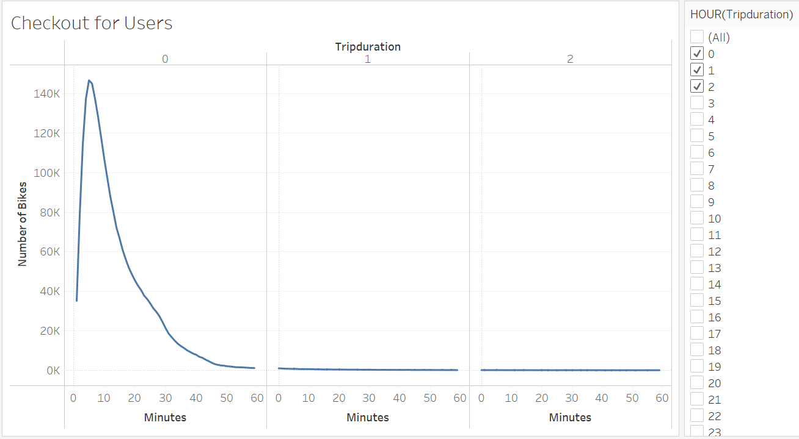
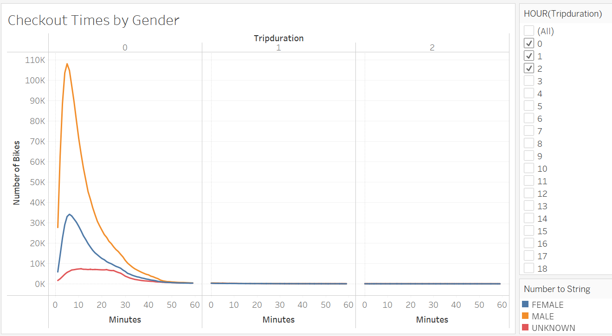
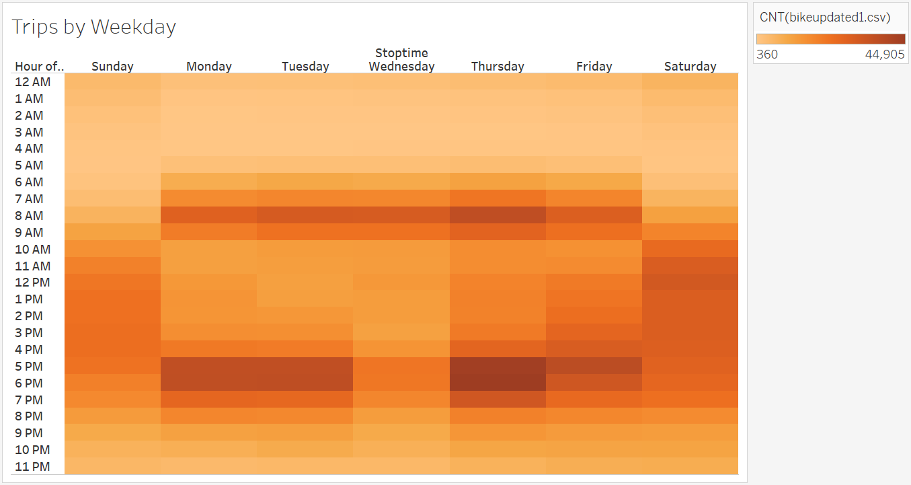
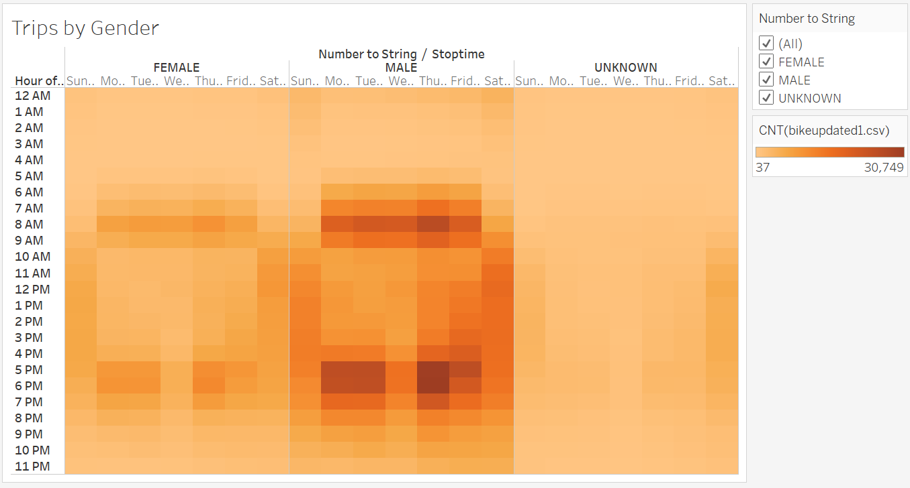
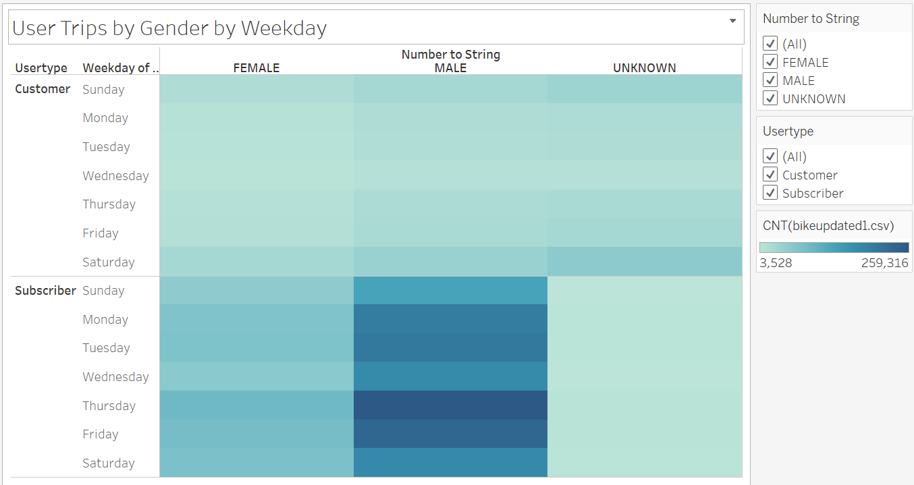
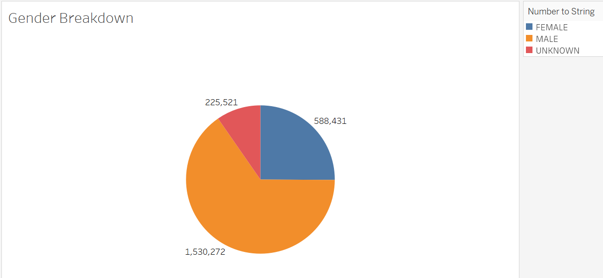
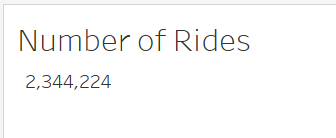

# bike_sharing
Module 14: NY Citibike with Tableau

## Project Overview
This project involves the use of Tableau to analyze of New York Citi Bike data. Data visualization tools such as Tableau were used to explore and identify trends of the bike-sharing business.

[link to dashboard](https://public.tableau.com/profile/robert1912#!/vizhome/Bike_Sharing_16198285438110/NYCBike?publish=yes)

[link to dashboard](https://public.tableau.com/profile/robert1912#!/vizhome/NYCBike_16198230280820/TopStartingLocations?publish=yes)

### Resources
- Data Source:
- Software: Tableau, Python

## Results

### Checkout for Users
How long bikes are checked out (in minutes). The visualization shows that not many bikes are used for over an hour (60 minutes). Main usage is within the first hour, peaking within 5 and 6 minutes.

### Checkout Times by Gender
How long bikes are checked out (in minutes) by gender. The visualization shows that majority of bike users were males. 

### Trips by Weekday
Number of bikesharing trips by day of the week in a twelve hour timeframe. The visualization shows that a high peak is on Thursdays between 5pm and 6pm. 

### Trips by Gender
Number of bikesharing trips by day of the week by gender. The visualization shows that males have a strong bike usage at 8am and 5/6pm. 

### User Trips by Gender by Weekday
Number of bikesharing trips by day of the week in a twelve hour timeframe by gender and usertype. The visualization shows that subscribers have higher number of trips compared to customers, majority males. 

### Gender Breakdown
A breakdown based on gender.The visualization shows that the majority of users in the data are male.

### Total number of rides.

## Summary
Based on the data, high usage of Citi bike sharing occurs in New York City by male users in the morning (8am) and evenings (5/6pm). Location plays a role in the number of rides from Citi Bike services since, New Yorkers needing additional fast transportation. This analysis could be benefitted by additional analysis comparing bike data for other months to observe the different variables included in this dataset, such as gender, time spent, etc. 
